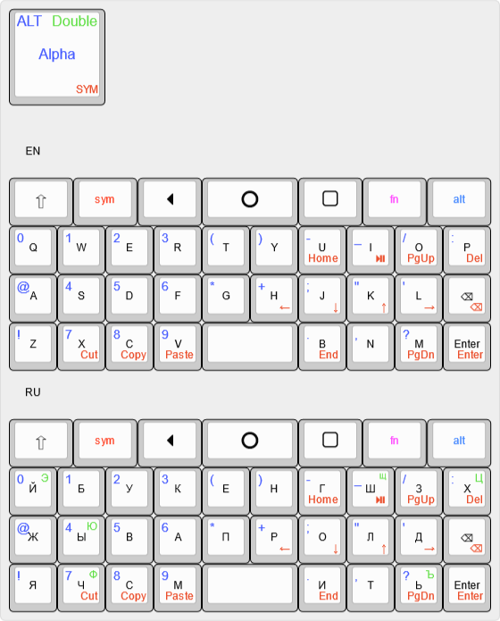

# PocketBoard IME




Это модификация [PocketBoard](https://github.com/SinuXVR/pocket-board). В которой изменена раскладка для русского языка (на основе [
jbak2 4row](https://github.com/aroum/jbak2_4row_orto_kbd)), а также навигационный слой (на основе [Watchman-layouts](https://github.com/aroum/Watchman-layouts)). 

Основной целью изменения раскладки русского языка было оставить на основном слое только [самые используемые буквы](https://ru.wikipedia.org/wiki/%D0%A7%D0%B0%D1%81%D1%82%D0%BE%D1%82%D0%BD%D0%BE%D1%81%D1%82%D1%8C). А все остальные перенести на двойные нажатия букв, которые никогда не встрчаются подряд в обычном тексте.

| Одинарное нажатие | Двойное нажатие |
|-------------------|-----------------|
| Ь                 | Ъ               | 
| Ш                 | Щ               | 
| Й                 | Э               | 
| Ч                 | Ф               | 
| Х                 | Ц               | 
| Ы                 | Ю               | 


А от слоя навигации SYM, хотелось получить возможность полноценно редактировать тексты, без постоянного переключения на буквенный слой чтобы удалить один знак. 


## Сборка APK

Я использую [Android Studio](https://developer.android.com/studio), но 

1) File > Open > pocket-board
2) Build > Generate Signed Bundle/APK... 
3) APK > Next
4) Выберите свой действующий ключ или сгенерируйте новый  > Next
5) release > Next
6) Finish
7) После сборки APK будут доступен в папке 
```app/release/app-release.apk```